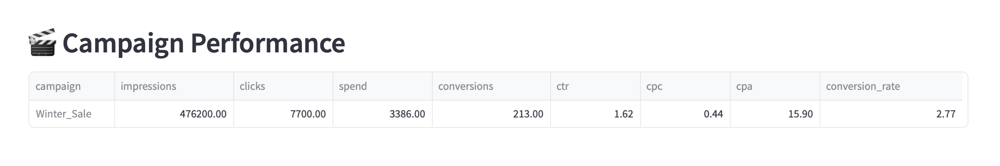

# 📊 Marketing Performance Consolidator

Consolidate ad data from Facebook, Google, LinkedIn (and others) into one place. Automatic KPI calculation included.

---

## What it does

Takes multiple CSV files from different ad platforms and:
- Merges them into one dataset
- Calculates standard marketing KPIs (CTR, CPC, CPA, conversion rate, CPM)
- Generates performance comparisons across platforms
- Points out what's working and what isn't

Two ways to use it:
- **Web interface:** Upload files, see results
- **Command line:** Drop CSVs in a folder, run script

---

## Why this exists

Marketers running campaigns on multiple platforms waste time:
- Downloading CSVs from each platform
- Copy-pasting into spreadsheets
- Manually calculating KPIs
- Making comparison charts

This automates it. Upload → Get analysis → Done.

---

## Quick start

### Web version

```bash
git clone https://github.com/DiiDayan/report-consolidator.git
cd report-consolidator
python3 -m venv venv
source venv/bin/activate
pip install -r requirements.txt
streamlit run app.py
```

### CLI version

```bash
# Put your CSVs in data/input/
python3 src/consolidator.py
# Results in output/
```

---

## What you get

**Platform comparison:**
```
Platform Performance:
          impressions  clicks  spend  conversions   ctr   cpc   cpa  conversion_rate
Facebook       254600    2546   1025           60  1.00  0.40  17.08             2.36
Google         161600    4250   1605          111  2.63  0.38  14.46             2.61
LinkedIn        60000     904    756           42  1.51  0.84  18.00             4.65
```

**Automatic insights:**
- Google has lowest CPC ($0.38)
- LinkedIn has best conversion rate (4.65%)
- Facebook represents 30% of total spend

**Charts comparing KPIs across platforms**

---

## Screenshots

### Welcome screen


### Platform analysis


### KPI charts


### Campaign breakdown


### Export options


---

## Data format

Your CSVs need these columns (tool auto-detects variations):

**Required:**
- `impressions` (or `views`)
- `clicks`
- `spend` (or `cost`)
- `conversions` (or `sales`)

**Optional:**
- `platform` - for cross-platform comparison
- `campaign` - for campaign-level analysis
- `date` - for time analysis

Column names are flexible. The tool handles common variations automatically.

---

## Calculated KPIs

- **CTR** (Click-Through Rate): `(clicks / impressions) × 100`
- **CPC** (Cost Per Click): `spend / clicks`
- **CPM** (Cost Per Mille): `(spend / impressions) × 1000`
- **CPA** (Cost Per Acquisition): `spend / conversions`
- **Conversion Rate**: `(conversions / clicks) × 100`
- **ROAS** (if revenue data): `revenue / spend`

---

## Tech stack

Python • Pandas • Matplotlib • Streamlit

---

## Roadmap

See [Issues](https://github.com/DiiDayan/report-consolidator/issues) for planned features:
- Excel file support
- Data validation
- Smart merge for related datasets
- Better chart design
- More platform integrations

---

## License

MIT

---

Built to solve a real workflow problem. If it helps you, use it.